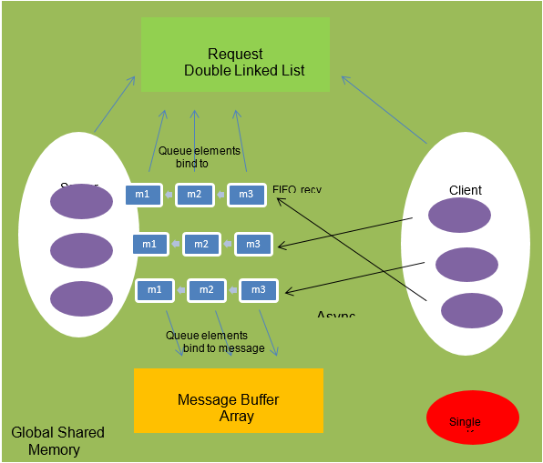
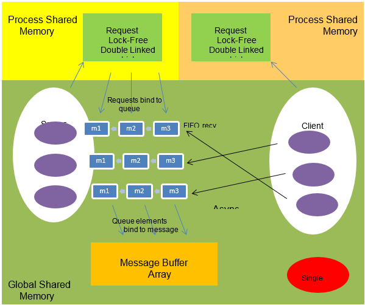
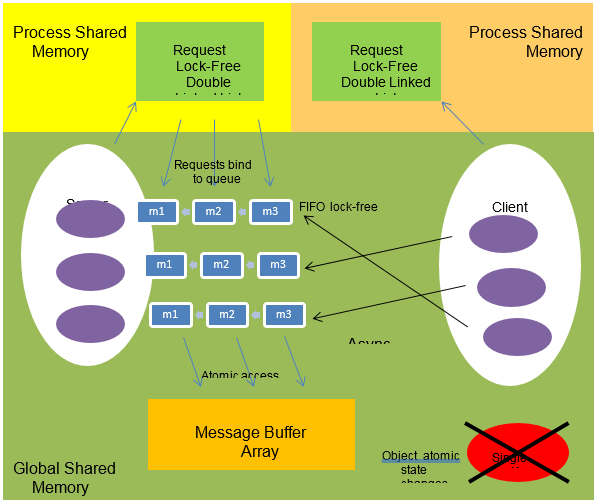
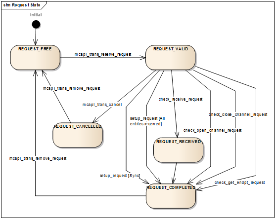
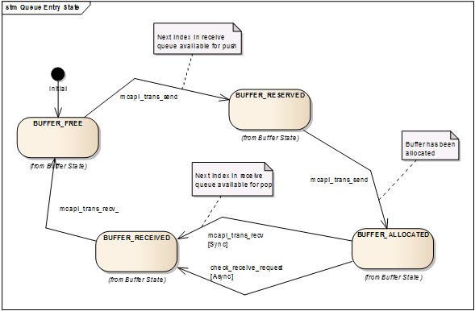

# MxAPI

Multicore Association APIs

## PROBLEM DESCRIPTION
### Concurrency Goals
Computation capacity increase comes naturally from increasing the number of processor cores, as long as the work can be performed in parallel. On the other hand, experience shows that I/O performance degrades as tasks are spread out across processors, typically due to cache misses and kernel lock convoys. The concurrency goals are to optimize task communication based on the available multi-core hardware and SMP operating system, with a modifiable software structure to support future variants. This enables MxAPI to be designed based on logical tasks communicating explicitly with each other.
### Concurrency Objectives
The objective for the concurrency libraries and tools is to accelerate embedded software development that targets multi-core hardware deployments. Programming abstractions for logical tasks reduce the dependence on specific hardware architectures, and the runtime implementation optimizes execution on each of the supported operating system platforms. Ideally, the platform developers never directly code using threads or have to add explicit locks to guard shared resources. The provided tools determine how to allocate logical tasks to underlying operating system resources based on the interactions between them and the target deployment environment.
## SOLUTION
### Logical Tasks
Given that a task is a set of instructions that can run without being blocked; the interactions between tasks and their resources can be modeled as a graph. The nodes are tasks and resources, and the edges are communication between them. Figure 3 below shows a top level view of this graph. Depending on the interactions some tasks should be “closer” to each other (Message Neighborhood), meaning performance is improved by reducing the communication latencies.  

*MxAPI Tasks, Messages and Resources*

This plays an important role in allocating logical tasks to operating system resources. Each deployment platform requires a different allocation for optimal performance. The static information in the graph for who communicates with whom can be analyzed like a social network to determine the best allocation of logical tasks to processes and threads, and the deployment can be run in “calibration” mode to further adjust the topology based on message traffic.
### Communication
Control application diagram execution with slightly stale inputs is acceptable, but the data cannot be changed within an execution cycle. It may also be important that collections of variable values be from the same data acquisition cycle. For these reasons data exchange must be implemented using messages rather than shared addresses to variable values.

Communication between tasks can be organized in two separate classes[1](#Kim2007):
1.	State Message – only interested in processing the most up-to-date data from producers, i.e. messages can be lost, and
2.	Event Message – every message must be consumed in order, i.e. no messages can be lost.  

An example of a state message is two threads sharing the address to a global variable. For state messages it is possible that the producer is never blocked, overwriting previous messages whether or not they have been read. The reader detects if the message was changed in the course of its access and retries accordingly. An example of an event message is a FIFO queue where ownership of an element is transferred from producer to consumer without the need to copy. Producer attempts to enter a message into the queue fail if all message buffers are in use by either producer or consumer, and consumer attempts to get the next message fail if the queue is empty or all active message buffers are owned by the producer.

The fundamental building block for communication is the one-way channel, either state or event message-based. From this foundation more complex hierarchies can be constructed, for example many-to-one fan-in or one-to-many fan-out. Order of event messages can be FIFO or priority-based allowing out-of-band communications to supersede normal processing.
### Shared Memory
Given a message abstraction that can survive hardware changes, what is the best messaging implementation technique possible today? Viper task communication can be based on available multicore hardware and SMP operating systems, with a modifiable software structure to support future variants. On shared memory architectures (multicore), the most efficient data exchange is through shared memory. Shared memory offers a high bandwidth, low latency alternative[2](#Smith2012). Using shared memory requires making decisions about the end points, such as how message ownership is transferred from producer to consumer and whether it is necessary to copy received messages into private buffers.
### Concurrency Runtime

*MxAPI Concurrency Runtime*

The MxAPI concurrency runtimes are based on the specifications being developed and published by the Multicore Association[3](#Multicore). The figure above shows the high level runtime stack with design layers corresponding to the Multicore Association reference implementation, shown in solid blue, and the Viper enhancements to the specifications shown in lighter blue. Key extensions are support for the Microsoft Windows operating system in addition to embedded RTOS, and real-time processes as well as kernel (single address space) deployments. Other ideas are first class support for atomic operations that enable lock-free algorithms, even across address spaces using shared memory duplication, and virtual time to allow simulations to run slower or faster than real-time.  
## RESULTS
### MRAPI
### MCAPI
MCAPI is the Multicore Communications API that supports synchronization and data exchange between tasks running on different cores. It provides blocking and non-blocking operations for connection-less messages, and connection-oriented packet and scalar data exchange. The reference implementation is designed with a user-mode (MRAPI) reader-write lock guarding a shared memory database for FIFO data exchange.  

Data exchange between tasks and processes using both state- and event-based communication is a key capability for any real-time software design. One approach is to depend on the RTOS runtime for IPC. The alternative is to design and implement a lightweight concurrency runtime that makes minimal use of the operating system and avoids the associated kernel overhead.  

#### Unit Tests
The MCAPI unit tests exercise the internal APIs that make up the runtime implementation. The external (according to Multicore Association specification) APIs are thin wrappers over the internal functions. Each function is called in turn with invalid and valid parameters. Using white box techniques, internal data structures are exposed to the unit tests and these are validated for expected pre- and post-conditions implemented as assertions. The unit tests form a safety net so if the implementation is revised or changed, test execution will rapidly reveal the regression.  

Having these tests dramatically increases confidence for taking risk in major refactoring experiments. For example, first the lock-based MCAPI reference implementation was built and verified using an initial version of the unit tests. Then the locks were removed incrementally as the unit tests verified continuously that there were no regressions. Finally the unit tests were updated to reflect and confirm the internal white box changes made to enhance the lock-free implementation.  

The categories of MCAPI unit tests are:
1.	Runtime initialization and rundown
2.	Requests
3.	Endpoints
4.	Queues
5.	Messages
6.	Packets
7.	Scalars

#### Message Topology

*Example Message Topology*

The test scenarios represent different message topologies, i.e. which tasks can communicate with each other and who initiates the transactions. The MCAPI specification provides the programmatic building blocks to configure the topology but this approach quickly becomes confusing and difficult to manage. As an alternative a declarative representation was adopted. The text box in the figure above shows a partial example where endpoints compose into channels that compose into links. This terminology draws from the telecommunications domain where:  

- Link – point-to-point, broadcast, multipoint, point to multipoint communications,
- Channel – used to convey an information signal from sender to receiver, and
- Endpoint – interface exposed by a communication channel.

The message topology is static for the life cycle of the device configuration. Node assignment to a task or process is independent of topology, and can vary based on the technology stack and deployment configuration. Each task parses the XML message topology specification and interprets the contents based on its domain and node assignment.  

The MCAPI runtime is enhanced to provide three functions:  

    PUBLIC  
    extern void mcapi_node_collect(  
        MCAPI_IN mca_domain_t domain_id,  
        MCAPI_IN mcapi_node_t node_num,  
        MCAPI_IN mxml_node_t* root,  
        MCAPI_OUT mcapi_config_t* config,  
        MCAPI_IN mca_timeout_t timeout,  
        MCAPI_OUT mcapi_status_t* mcapi_status);

    PUBLIC  
    extern void mcapi_node_connect(  
        MCAPI_IN mca_domain_t domain_id,  
        MCAPI_IN mcapi_node_t node_num,  
        MCAPI_OUT mcapi_config_t* config,  
        MCAPI_IN mca_timeout_t timeout,  
        MCAPI_OUT mcapi_status_t* mcapi_status);  

    PUBLIC  
    extern void mcapi_node_disconnect(  
        MCAPI_IN mca_domain_t domain_id,  
        MCAPI_IN mcapi_node_t node_num,  
        MCAPI_OUT mcapi_config_t* config,  
        MCAPI_IN mca_timeout_t timeout,  
        MCAPI_OUT mcapi_status_t* mcapi_status);  

where <i>root</i> is the parsed DOM (Document Object Model) for the XML message topology declaration and <i>config</i> is the corresponding in-memory representation. When a task calls the <b>mcapi_node_collect</b> function it parses all the endpoints, connections and links to an internal representation. When the <b>mcapi_node_connect</b> function is called it allocates all the necessary endpoints and connections associated with that task based on the configured domain and node IDs. When a task calls the <b>mcapi_node_disconnect</b> function the related connections and endpoints are run down and the resources are released.    

The runtime can be additionally enhanced to support a task querying the configuration to discover the declared configuration and link types. Full duplex link pattern is only one of many possible, for example *P/1C, 1P/*C, *P/*C, etc. where P represents producer and C consumer. Based on the link types there can be standard operations, for example subscribe to a server task or broadcast to a set of listeners.  

#### Reference Design

*MCAPI Reference Design*

The Multicore Association’s top priority is to guide and direct the API specifications leaving products and markets to the vendors. However, they provide reference implementations of the concurrency runtimes as a starting point and to validate the specifications. The MCAPI reference design uses traditional lock-based techniques for handling concurrency and appears to mainly address issues related to multiple threads on a single processor.  

The reference design is shown in the figure above. The implementation uses global shared memory, guarded by a single kernel lock, enabling data exchange between tasks and processors on a single device. The producer endpoints (ep) insert messages into consumer ep FIFO receive queues, where each queue entry (m) is bound to a reusable message buffer. Request objects are used to track asynchronous send and receive operations, allowing a separate task to complete an operation started by the originator. Consumers can reserve queue elements that will be filled later by producers.  

#### Lock-Free Requests (Version 1)

*MCAPI Lock-free Requests, Version 1*

The overall goal in refactoring MCAPI is to eliminate the single kernel lock without introducing any concurrency defects or data corruption. The first area of focus was the asynchronous message bookkeeping provided by the request double linked list. Two lists are maintained: 1) empty, containing the request IDs that are available for use, and 2) full, request IDs that are active or already marking reserved locations in a message queue. The kernel lock is completely reliable in guarding these data structure, but removing the lock creates problems from simultaneous request allocations from multiple clients and keeping the list linkages consistent.  

Each element in a doubly linked list has both a forward (next) and backward (prev) reference to reduce the processing overhead needed to insert and remove elements at any location in the list. Lock-free techniques make use of CPU atomic operations but it is not possible to simultaneously update two memory locations reliably. Sundell and Tsigas[5](#Sundell2008) provide a set of algorithms that reliably update the next references and then “clean up” any errors in the prev references.

The first version of this refactoring is shown in the figure above. In anticipation that the lock-free doubly linked list approach would be impossible using spinning on Linux, the request lists were moved from global shared memory to process memory and bindings previous made from queue messages to requests were reversed. This means an asynchronous request may only be completed by a task in the same process. Functionally the lock-free algorithms worked properly as validated by the unit tests but full confidence could not be confirmed until the kernel lock was removed.  

#### Lock-Free Queues

*MCAPI Lock-free Queues*

With the request lists refactored, the next focus was on the message receive queues. The original implementation uses a circular array with external head and tail references. The kernel lock is completely reliable in guarding this data structure, but removing the lock creates problems from simultaneous message buffer allocations from multiple clients.  

The head and tail references and queue bookkeeping are replaced by the lock-free algorithms[1](#Kim2007). The FIFO receive queue is refactored to allow concurrent access across task and process boundaries. All object (e.g. message) state changes are performed with atomic operations, and the single kernel lock is finally removed.  

#### Finite State Transitions

Debugging race conditions is non-trivial in high throughput, low latency designs. The main challenge is introduction of measurements or log output causes changes to the runtime dynamics. The concurrency defect is either hidden or shifted to other locations in the code. A robust technique that resolves this dilemma is to design finite state transitions for each object type and then assert that only those transitions are allowed.  

##### Request Transitions

*MCAPI Request Transitions*

Requests in the original implementation are marked with several boolean flags that indicate if the request is valid, completed, or cancelled. These flags were replaced with the state transition diagram shown in the figure above. All changes to state are performed using atomic operations where the previous state is verified.  

A request in the REQUEST_FREE state is available for any client to identify a pending asynchronous operation, e.g. opening a channel, sending a message, etc. Once the request is allocated its state changes to REQUEST_VALID. For all operations other than asynchronous send, completion of the request changes the state to REQUEST_COMPLETED. For the exceptional send case, the request is marked as REQUEST_RECEIVED until the buffer can be confirmed received, and then the request state changes to REQUEST_COMPLETED. The request is then transitioned back to the available pool by changing its state to REQUEST_FREE. Cancelling a pending receive request (send requests always complete) changes the state to REQUEST_CANCELLED, and then REQUEST_FREE to make the cancelled request ID available for future operations.  

##### Queue Entry Transitions

*MCAPI Queue Entry Transitions*

Receive FIFO queue entries are marked in the original implementation with a boolean flag indicating if the entry is valid or not. This flag was replaced with state transition diagram shown in the figure above. All changes to state are performed using atomic operations where the previous state is verified.  

A queue entry in the BUFFER_FREE state does not have a buffer associated with it. Once a queue entry is available to receive a message it transitions to the BUFFER_RESERVED state. This guards the entry from use by other clients until a free buffer can be linked to the entry, where the state transitions to BUFFER_ALLOCATED. When the message is at the head of the receive queue it is marked as BUFFER_RECEIVED to keep other listeners on the same endpoint from trying to read its buffer. The queue entry returns to the BUFFER_FREE state when the receive operation is complete.  

<a name="Kim2007">1</a>: Kim, et.al., "Efficient Adaptations of the Non-Blocking Buffer for Event Communication", Proceedings of ISORC, pp. 29-40 (2007).  
<a name="Smith2012">2</a>: Smith, et. al, "Have you checked your IPC performance lately?" Submitted to USENIX ATC (2012).  
<a name="Multicore">3</a>: Multicore Association, http://www.multicore-association.org/index.php  
<a name="DesignRules">4</a>: StackOverflow Discussion, http://stackoverflow.com/questions/3609469/what-are-the-thread-limitations-when-working-on-linux-compared-to-processes-for  
<a name="Sundell2008">5</a>: Sundell, H., Tsigas, P., "Lock-free deques and doubly linked lists", Journal of Parallel and Distributed Computing , Vol. 68, pp. 1008-1020 (2008).  
