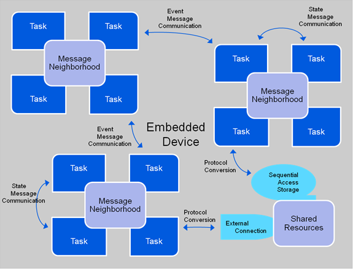
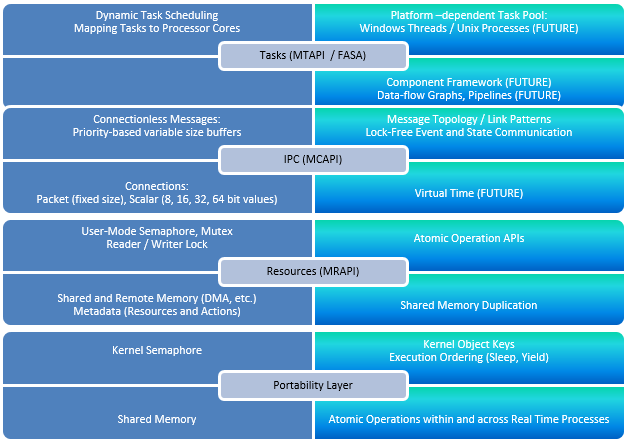

# MxAPI

Multicore Association APIs

## PROBLEM DESCRIPTION
### Concurrency Goals
Computation capacity increase comes naturally from increasing the number of processor cores, as long as the work can be performed in parallel. On the other hand, experience shows that I/O performance degrades as tasks are spread out across processors, typically due to cache misses and kernel lock convoys. The concurrency goals are to optimize task communication based on the available multi-core hardware and SMP operating system, with a modifiable software structure to support future variants. This enables MxAPI to be designed based on logical tasks communicating explicitly with each other.
### Concurrency Objectives
The objective for the concurrency libraries and tools is to accelerate embedded software development that targets multi-core hardware deployments. Programming abstractions for logical tasks reduce the dependence on specific hardware architectures, and the runtime implementation optimizes execution on each of the supported operating system platforms. Ideally, the platform developers never directly code using threads or have to add explicit locks to guard shared resources. The provided tools determine how to allocate logical tasks to underlying operating system resources based on the interactions between them and the target deployment environment.
## SOLUTION
### Logical Tasks
Given that a task is a set of instructions that can run without being blocked; the interactions between tasks and their resources can be modeled as a graph. The nodes are tasks and resources, and the edges are communication between them. Figure 3 below shows a top level view of this graph. Depending on the interactions some tasks should be “closer” to each other (Message Neighborhood), meaning performance is improved by reducing the communication latencies.  

*MxAPI Tasks, Messages and Resources*

This plays an important role in allocating logical tasks to operating system resources. Each deployment platform requires a different allocation for optimal performance. The static information in the graph for who communicates with whom can be analyzed like a social network to determine the best allocation of logical tasks to processes and threads, and the deployment can be run in “calibration” mode to further adjust the topology based on message traffic.
### Communication
Control application diagram execution with slightly stale inputs is acceptable, but the data cannot be changed within an execution cycle. It may also be important that collections of variable values be from the same data acquisition cycle. For these reasons data exchange must be implemented using messages rather than shared addresses to variable values.

Communication between tasks can be organized in two separate classes[1](#Kim2007):
1.	State Message – only interested in processing the most up-to-date data from producers, i.e. messages can be lost, and
2.	Event Message – every message must be consumed in order, i.e. no messages can be lost.  

An example of a state message is two threads sharing the address to a global variable. For state messages it is possible that the producer is never blocked, overwriting previous messages whether or not they have been read. The reader detects if the message was changed in the course of its access and retries accordingly. An example of an event message is a FIFO queue where ownership of an element is transferred from producer to consumer without the need to copy. Producer attempts to enter a message into the queue fail if all message buffers are in use by either producer or consumer, and consumer attempts to get the next message fail if the queue is empty or all active message buffers are owned by the producer.

The fundamental building block for communication is the one-way channel, either state or event message-based. From this foundation more complex hierarchies can be constructed, for example many-to-one fan-in or one-to-many fan-out. Order of event messages can be FIFO or priority-based allowing out-of-band communications to supersede normal processing.
### Shared Memory
Given a message abstraction that can survive hardware changes, what is the best messaging implementation technique possible today? Viper task communication can be based on available multicore hardware and SMP operating systems, with a modifiable software structure to support future variants. On shared memory architectures (multicore), the most efficient data exchange is through shared memory. Shared memory offers a high bandwidth, low latency alternative[2](#Smith2012). Using shared memory requires making decisions about the end points, such as how message ownership is transferred from producer to consumer and whether it is necessary to copy received messages into private buffers.
### Concurrency Runtime

*MxAPI Concurrency Runtime*

The MxAPI concurrency runtimes are based on the specifications being developed and published by the Multicore Association[3](#Multicore). The figure above shows the high level runtime stack with design layers corresponding to the Multicore Association reference implementation, shown in solid blue, and the Viper enhancements to the specifications shown in lighter blue. Key extensions are support for the Microsoft Windows operating system in addition to embedded RTOS, and real-time processes as well as kernel (single address space) deployments. Other ideas are first class support for atomic operations that enable lock-free algorithms, even across address spaces using shared memory duplication, and virtual time to allow simulations to run slower or faster than real-time.  
## RESULTS
[MRAPI](./mca-2.0.3/mrapi/README.md)  
[MCAPI](./mca-2.0.3/mcapi/README.md)

<a name="Kim2007">1</a>: Kim, et.al., "Efficient Adaptations of the Non-Blocking Buffer for Event Communication", Proceedings of ISORC, pp. 29-40 (2007).  
<a name="Smith2012">2</a>: Smith, et. al, "Have you checked your IPC performance lately?" Submitted to USENIX ATC (2012).  
<a name="Multicore">3</a>: Multicore Association, http://www.multicore-association.org/index.php  
