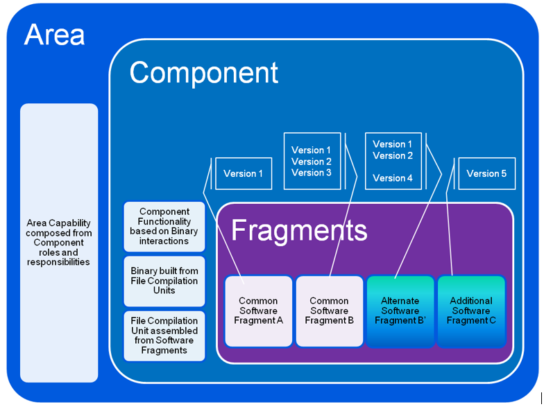

# MxAPI

Multicore Association APIs

## PROBLEM DESCRIPTION
### Concurrency Goals
Computation capacity increase comes naturally from increasing the number of processor cores, as long as the work can be performed in parallel. On the other hand, experience shows that I/O performance degrades as tasks are spread out across processors, typically due to cache misses and kernel lock convoys. The concurrency goals are to optimize task communication based on the available multi-core hardware and SMP operating system, with a modifiable software structure to support future variants. This enables MxAPI to be designed based on logical tasks communicating explicitly with each other.
### Concurrency Objectives
The objective for the concurrency libraries and tools is to accelerate embedded software development that targets multi-core hardware deployments. Programming abstractions for logical tasks reduce the dependence on specific hardware architectures, and the runtime implementation optimizes execution on each of the supported operating system platforms. Ideally, the platform developers never directly code using threads or have to add explicit locks to guard shared resources. The provided tools determine how to allocate logical tasks to underlying operating system resources based on the interactions between them and the target deployment environment.
## SOLUTION
### Logical Tasks
Given that a task is a set of instructions that can run without being blocked; the interactions between tasks and their resources can be modeled as a graph. The nodes are tasks and resources, and the edges are communication between them. Figure 3 below shows a top level view of this graph. Depending on the interactions some tasks should be “closer” to each other (Message Neighborhood), meaning performance is improved by reducing the communication latencies.  

*MxAPI Tasks, Messages and Resources*

This plays an important role in allocating logical tasks to operating system resources. Each deployment platform requires a different allocation for optimal performance. The static information in the graph for who communicates with whom can be analyzed like a social network to determine the best allocation of logical tasks to processes and threads, and the deployment can be run in “calibration” mode to further adjust the topology based on message traffic.
### Communication
Control application diagram execution with slightly stale inputs is acceptable, but the data cannot be changed within an execution cycle. It may also be important that collections of variable values be from the same data acquisition cycle. For these reasons data exchange must be implemented using messages rather than shared addresses to variable values.

Communication between tasks can be organized in two separate classes[1](#Kim2007):
1.	State Message – only interested in processing the most up-to-date data from producers, i.e. messages can be lost, and
2.	Event Message – every message must be consumed in order, i.e. no messages can be lost.  

An example of a state message is two threads sharing the address to a global variable. For state messages it is possible that the producer is never blocked, overwriting previous messages whether or not they have been read. The reader detects if the message was changed in the course of its access and retries accordingly. An example of an event message is a FIFO queue where ownership of an element is transferred from producer to consumer without the need to copy. Producer attempts to enter a message into the queue fail if all message buffers are in use by either producer or consumer, and consumer attempts to get the next message fail if the queue is empty or all active message buffers are owned by the producer.

The fundamental building block for communication is the one-way channel, either state or event message-based. From this foundation more complex hierarchies can be constructed, for example many-to-one fan-in or one-to-many fan-out. Order of event messages can be FIFO or priority-based allowing out-of-band communications to supersede normal processing.
### Shared Memory
Given a message abstraction that can survive hardware changes, what is the best messaging implementation technique possible today? Viper task communication can be based on available multicore hardware and SMP operating systems, with a modifiable software structure to support future variants. On shared memory architectures (multicore), the most efficient data exchange is through shared memory. Shared memory offers a high bandwidth, low latency alternative[2](#Smith2012). Using shared memory requires making decisions about the end points, such as how message ownership is transferred from producer to consumer and whether it is necessary to copy received messages into private buffers.
### Concurrency Runtime

*MxAPI Concurrency Runtime*

The MxAPI concurrency runtimes are based on the specifications being developed and published by the Multicore Association[3](#Multicore). The figure above shows the high level runtime stack with design layers corresponding to the Multicore Association reference implementation, shown in solid blue, and the Viper enhancements to the specifications shown in lighter blue. Key extensions are support for the Microsoft Windows operating system in addition to embedded RTOS, and real-time processes as well as kernel (single address space) deployments. Other ideas are first class support for atomic operations that enable lock-free algorithms, even across address spaces using shared memory duplication, and virtual time to allow simulations to run slower or faster than real-time.  
## RESULTS
### Windows Target
What IDE is used to build MxAPI on Windows? Visual Studio 2017. https://visualstudio.microsoft.com/downloads/

Note: Build mxml 2.12 with solution in vxnet. 
### Linux Target
What IDE is used to build MxAPI on Linux? Code::Blocks 17.12-1. http://www.codeblocks.org/

How do I install Code::Blocks on Ubuntu? Download the installation .tar.xz file from the website. Unpack the archive and then install the components.

    $ tar -xf codeblocks_17.12-1_amd64_stable.tar.xz 
    $ sudo apt install ./libcodeblocks0_17.12-1_amd64.deb 
    $ sudo apt install ./codeblocks-common_17.12-1_all.deb 
    $ sudo apt install ./codeblocks_17.12-1_amd64.deb 
    
How do I build the mxml library? Use configure to generate the make files (configure needs to be executable)

    $ ./configure 
    $ make all 
    $ sudo make install 
    
What are the compiler settings in Code::Blocks to build on Linux? Set independent of Debug or Release.

    Compiler Flags: 
    Have g++ follow the 1998 ISO C++ language standard 
    Have gcc follow the 2011 ISO C language standard 
    Position Independent Code 
    Target x86_64 (64bit) 
    #defines:
    _POSIX_C_SOURCE
    
### Detailed Descriptions
[MRAPI](./mca-2.0.3/mrapi/README.md)  
[MCAPI](./mca-2.0.3/mcapi/README.md)  
[MTAPI](./mca-2.0.3/mtapi/README.md)  

## Variant Management

One of the hurdles becoming productive in a software implementation that is intended for multiple platforms is navigating the conditional compiler directives. Determining which code lines are active can be a challenge.  

*Variant Management*

A proposed alternative to this is to use code fragments. This concept is very new, but recent experiments have shown promise both in source code control management strategies and in debugging and making changes to the implementation.  

The implementation is organized as a set of Areas, where each area is responsible for a capability or feature of the product. Each area contains Components that have specific roles and responsibilities. A component’s functionality is based on a collection of binaries which are built from file compilation units or source files.  

*Software Fragments Example*

Typically source files have thousands of lines of code implementing many functions. The proposed technique is to break these files up into fragments that are composed into file compilation units using the compiler #include directive in a top level or index source file, as shown in the figure above.  

The benefits are that the elements being versioned in source code control are shared by many variants or specific to a variant, and single stepping with the debugger only shows the code for the variant that was built, not all the variants with their conditional compiler directives. In this example the variants are separating the baseline Multicore Association reference implementation from ABB enhancements, but the same could be used to implement pools of threads for Windows compared to pools of processes for Linux.  

## API Conventions

Naming conventions in software development bring a consistent framework that is shared by the participants and can have a dramatic impact on productivity. The Multicore Association reference implementation is in the C programming language. For that development environment, function and variable names must be unique within a scope. Unfortunately for C, the scope often times is global requiring names be made unique by lengthy family name prefixes. That makes them longer to type out and more difficult to identify in the body of the code.  

An alternative is to use a naming convention that is terse and does not conflict with other names in the same scope. The goal is to have function names almost be part of the programming language, similar to what is possible with programming languages that have named scopes. For example, in C# the <b>lock()</b> operation can be performed on almost any object.  

    Proposed Syntax:
    <result> = <operation_name>_([<arg.]*), where <operation_name> is terse and the trailing underscore (_) identifies our namespace.
    For example, lock_(<object_handle>)

The semantics of the operation can be managed without needing a type-specific operation name. Object handles in the reference implementation are generally indexes into fixed arrays. Typically the maximum index value is far less than the largest number able to be stored in the handle variable. The high order bits of the handle can be used as a mask to indicate which type of handle, and then the corresponding type-specific operation is called underneath. This allows type-specific interpretation of generic operation names.  

## Lock-Free Algorithms

A key concurrency requirement is data consistency, i.e. one task should not corrupt the data another task is using. A number of enabling conventions are already in place, especially for embedded operating systems

1.	The smallest RAM access / mutation is a byte.
Access to system main memory (RAM) depends on the underlying CPU hardware and the specified coherency protocol. For example, the PowerPC reads and writes to memory in bytes[4](#PowerPC), where each byte access is atomic and multiple bytes can be read or written in any order. With multiple processor cores this means copying any data type larger than a byte must be explicitly protected where there is contention for the location between cores.
2.	The RTOS tool chain can provide implicit atomic operations.
The source code compiler used to build the embedded image for VxWorks generates atomic instructions for four byte memory writes by default, making explicit atomic sets and gets unnecessary. Copying data types larger than four bytes needs explicit synchronization to ensure atomic reliability. On the PowerPC atomic operations on the same memory location are executed in program order without need for an explicit memory barrier.

Data consistency across address spaces and for non-atomic types requires explicit programming instructions.

*Lock-Free State Messaging*

There are two classes of communication: state and event. For lock-free state messaging, the Non-blocking Write protocol (NBW)[5](#Kopetz1993) is used. As shown in the figure above, this covers a scenario where it does not make sense to block the writer. Single writer, multiple concurrent reader configurations are possible. The design has the following properties:  

1.	Safety property – if a read operation completes successfully, it must be guaranteed that it has read an uncorrupted version.
2.	Timeliness property – the tasks containing the read operations must complete their executions before deadline, and
3.	Non-blocking property – the writer cannot be blocked by readers.

The algorithm is implemented with an atomic counter, initially set to zero. The approach is similar to optimistic record locking in databases. Each time the writer has a new value, it first increments the counter, writes the value into the next available buffer, and then increments the counter again. A reader grabs the value of the counter, reads the value in the associated buffer, and then checks to see if the value was corrupted while it was being read. If the value was overwritten during the process of reading (counter tests odd), the reader attempts to read again. The more buffers the less likely it is there will be a collision between reading and writing.  

*Lock-Free Event Messaging*

The Non-Blocking Buffer (NBB)[1](#Kim2007) is used for lock-free event messaging. As shown in the figure above there are now two atomic counters, one for the Producer and one for the Consumer. The underlying data structure is a ring buffer between them where event messages are passed without experiencing blocked states. The NBB is a circular FIFO queue where the two counters, update and acknowledge, ensure the Producer and Consumer always access different slots in the ring buffer. The size of the NBB needs to be able to accommodate message bursts.  

The two counters guard the two sections of the ring buffer: 1) the portion available to write, and 2) the portion available to read. Similar to NBW, each counter is incremented before an operation starts, and then again after the operation completes.  

The <b>InsertItem</b> operation either succeeds or returns one of two errors:

1.	BUFFER_FULL – there is no room for additional items, the caller should yield the processor and retry, perhaps after some delay, or
2.	BUFFER_FULL_BUT_CONSUMER_READING – there is not room for additional items, but the caller should not yield the processor and retry immediately a limited number of times with no delay.  

The ReadItem operation either succeeds or returns one of two errors:

1.	BUFFER_EMPTY – there are not pending items to be read, the caller should yield the processor and retry, perhaps after some delay, or
2.	BUFFER_EMPTY_BUT_PRODUCER_INSERTING – there are no pending items to read, but the caller should not yield the processor and retry immediately a limited number of times with no delay.  

The same design properties from NBW can be tested here:

1.	Safety property – guarantee of uncorrupted read holds true,
2.	Timeliness property – read operations either complete successfully with no delay, fail with a limited number of immediate retries (not compromising the deadline), or fail with indication to attempt the read in the next cycle,
3.	Non-blocking property – write operations either complete successfully with no delay, or fail with a limited number of immediate retries (not blocking further processing) if the reader is stalled for any reason.

Another benefit of NBB: event messages do not need to necessarily be copied into the buffer as part of the <b>InsertItem</b> operation, nor do they need to be copied out of the buffer as part of the <b>ReadItem</b> operation. Given a large enough pool of messages, the writer can allocate one for its use in preparing the message and when complete insert the pointer into the buffer. The reader then takes ownership of that pointer and uses it in its processing, explicitly releasing ownership when it is done to recycle the pointer back to the writer. As long as both the writer and reader use the messages for limited periods of time, no explicit copy is needed and the data exchange latency does not grow if the size of the message gets bigger.  

Message buffers, either NBW or NBB, can be composed to provide more complex messaging designs. For example, the figure below shows NBBs combined for a message concentrator with multiple producers feeding a single consumer (*P/1C).  One NBB is used for each producer and the consumer has a strategy, for example round robin, for determining which NBB is read next.  

*Multiple Producers, One Consumer*

*One Producer, Multiple Consumers*

Additionally, the figure above shows a different design for one producer feeding multiple consumers (1P/*C). There are multiple strategies for how messages are distributed, including:  

1.	Unicast – different, independent messages to each consumer,
2.	Broadcast – the same message to each consumer,
3.	Multicast – the same message to a subset of the consumers, and
4.	Anycast – a message read by one consumer is no longer available to the other consumers.

A combination of these designs could provide many-to-many (*P/*C) structures. The important thing to note is that they are all lock-free and do not incur substantial latency to communicate between Producer and Consumer, given the assumptions of shared memory and atomic CPU operations.  

## Spinning

The lack of atomic CPU operations does not preclude lock-free data exchange. Spinning[6](#Unrau1998) uses shared memory and appropriate polling of flags to determine when it is safe to read or write a shared memory location. This technique works when the polling does not consume substantial amounts of CPU resource.  

A flag is used in shared memory to indicate if a buffer slot is owned by the Producer or Consumer. As shared memory is managed in pages (1024 bytes), the flag is located close to the buffer address to ensure that if the flag is updated, the data is as well. The typical sequences of operations for polling are:  

    Initialization:
    SET write buffer index to zero
    SET read buffer index to zero
    Writer:
    WHILE write buffer flag is owned by Consumer,
	    YIELD processor
    ENDWHILE
    INSERT message into write buffer
    TRANSFER write buffer flag ownership to reader
    BARRIER
    INCREMENT write buffer index
    Reader:
    WHILE read buffer flag is owned by Producer,
	    YIELD processor
    ENDWHILE
    READ message from read buffer
    TRANSFER read buffer flag ownership to writer
    BARRIER
    INCREMENT read buffer index

BARRIER indicates a full memory barrier where all main memory reads and writes are guaranteed to be complete before continuing.  

What is interesting is that if the Producer has more than one message to write, it will run unblocked until all the available (owned by Producer) buffers are filled. The same happens with the Consumer in that if there are multiple messages available (owned by Consumer) to read, it will run unblocked until the messages have been processed.   

Experiments on Windows show that this spinning [SleepEx(0,0)] consumes all available CPU resources on the cores where the Producer and Consumer threads are running. On the other hand, Linux spinning [sched_yield()] consumes almost no CPU on the running cores. That makes spinning very attractive for Linux especially since we have no guarantee of atomic CPU instructions across shared memory between processes. Windows can still use the defined NBW, NBB designs because atomic operations across processes are possible for that platform.  

## Lessons Learned

The following lessons were learned (or re-learned) while migrating MRAPI and MCAPI to lock-free operation:  

* Concurrent software development is hard  
    * There are minimal supporting tools because instrumenting performance changes the runtime behavior. Logging to private memory and careful temporary introduction of minimal output messages (printf) can reveal sequences of interactions between tasks and confirm a software change corrects the defect.  
* It is non-trival to set up tests to stress concurrency features in a way that exposes defects. Key considerations are the simultaneous run-up and rundown of tasks across processes and making sure that writers and readers are evenly participating in the data exchange.  
* CPU affinity for tasks is not always the best configuration, your mileage will vary  
    * CPU affinity helps if a task’s memory fits in the L2 cache and can run exclusively on that core without being blocked. CPU affinity can hurt if two tasks are running on different cores and the data they exchange fits into the L2 cache. Tests should be run to confirm whether CPU affinity enhances or degrades performance for a specific deployment.  

The follow best practices are recommended for embedded concurrent software development:  

* Use the Microsoft Windows technology stack for primary development, then verify the same implementation works on non-Windows platforms.
* Implement unit module tests that assert single thread operations with pre- and post-conditions.
* Use stress tests on single core and on multicore with and without CPU affinity to identify concurrency issues.
* Start from a working baseline and validate small revisions where it is known exactly what changed.
* Use finite state to synchronize objects between tasks. Always verify the previous state before allowing a transition to the new state.

<a name="Kim2007">1</a>: Kim, et.al., "Efficient Adaptations of the Non-Blocking Buffer for Event Communication", Proceedings of ISORC, pp. 29-40 (2007).  
<a name="Smith2012">2</a>: Smith, et. al, "Have you checked your IPC performance lately?" Submitted to USENIX ATC (2012).  
<a name="Multicore">3</a>: Multicore Association, http://www.multicore-association.org/index.php  
<a name="PowerPC">4</a>: PowerPC storage model and AIX programming, http://www.ibm.com/developerworks/systems/articles/powerpc.html (2005).  
<a name="Kopetz1993">5</a>: Kopetz, Reisinger, "The Non-Blocking Write Protocol NBW: A solution to a Real-Time Synchronization Problem". In Real Time Systems Symposium, pp 131-137 (1993).  
<a name="Unrau1998">6</a>: Unrau, Krieger, Efficient Sleep/Wake-up Protocols for User-Level IPC. In Inter. Conf. On Parallel Processing, pp. 560-569 (1998).
