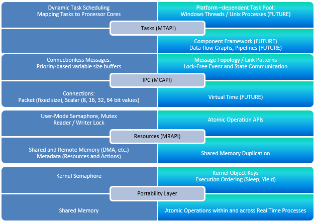
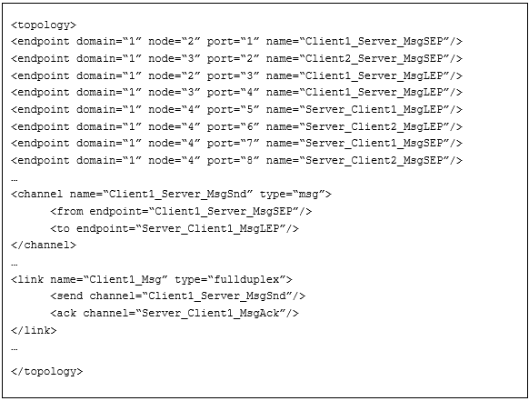

# MxAPI

Multicore Association APIs

## PROBLEM DESCRIPTION
### Concurrency Goals
Computation capacity increase comes naturally from increasing the number of processor cores, as long as the work can be performed in parallel. On the other hand, experience shows that I/O performance degrades as tasks are spread out across processors, typically due to cache misses and kernel lock convoys. The concurrency goals are to optimize task communication based on the available multi-core hardware and SMP operating system, with a modifiable software structure to support future variants. This enables MxAPI to be designed based on logical tasks communicating explicitly with each other.
### Concurrency Objectives
The objective for the concurrency libraries and tools is to accelerate embedded software development that targets multi-core hardware deployments. Programming abstractions for logical tasks reduce the dependence on specific hardware architectures, and the runtime implementation optimizes execution on each of the supported operating system platforms. Ideally, the platform developers never directly code using threads or have to add explicit locks to guard shared resources. The provided tools determine how to allocate logical tasks to underlying operating system resources based on the interactions between them and the target deployment environment.
## SOLUTION
### Logical Tasks
Given that a task is a set of instructions that can run without being blocked; the interactions between tasks and their resources can be modeled as a graph. The nodes are tasks and resources, and the edges are communication between them. Figure 3 below shows a top level view of this graph. Depending on the interactions some tasks should be “closer” to each other (Message Neighborhood), meaning performance is improved by reducing the communication latencies.  

*MxAPI Tasks, Messages and Resources*

This plays an important role in allocating logical tasks to operating system resources. Each deployment platform requires a different allocation for optimal performance. The static information in the graph for who communicates with whom can be analyzed like a social network to determine the best allocation of logical tasks to processes and threads, and the deployment can be run in “calibration” mode to further adjust the topology based on message traffic.
### Communication
Control application diagram execution with slightly stale inputs is acceptable, but the data cannot be changed within an execution cycle. It may also be important that collections of variable values be from the same data acquisition cycle. For these reasons data exchange must be implemented using messages rather than shared addresses to variable values.

Communication between tasks can be organized in two separate classes[1](#Kim2007):
1.	State Message – only interested in processing the most up-to-date data from producers, i.e. messages can be lost, and
2.	Event Message – every message must be consumed in order, i.e. no messages can be lost.  

An example of a state message is two threads sharing the address to a global variable. For state messages it is possible that the producer is never blocked, overwriting previous messages whether or not they have been read. The reader detects if the message was changed in the course of its access and retries accordingly. An example of an event message is a FIFO queue where ownership of an element is transferred from producer to consumer without the need to copy. Producer attempts to enter a message into the queue fail if all message buffers are in use by either producer or consumer, and consumer attempts to get the next message fail if the queue is empty or all active message buffers are owned by the producer.

The fundamental building block for communication is the one-way channel, either state or event message-based. From this foundation more complex hierarchies can be constructed, for example many-to-one fan-in or one-to-many fan-out. Order of event messages can be FIFO or priority-based allowing out-of-band communications to supersede normal processing.
### Shared Memory
Given a message abstraction that can survive hardware changes, what is the best messaging implementation technique possible today? Viper task communication can be based on available multicore hardware and SMP operating systems, with a modifiable software structure to support future variants. On shared memory architectures (multicore), the most efficient data exchange is through shared memory. Shared memory offers a high bandwidth, low latency alternative[2](#Smith2012). Using shared memory requires making decisions about the end points, such as how message ownership is transferred from producer to consumer and whether it is necessary to copy received messages into private buffers.
### Concurrency Runtime

*MxAPI Concurrency Runtime*

The MxAPI concurrency runtimes are based on the specifications being developed and published by the Multicore Association[3](#Multicore). The figure above shows the high level runtime stack with design layers corresponding to the Multicore Association reference implementation, shown in solid blue, and the Viper enhancements to the specifications shown in lighter blue. Key extensions are support for the Microsoft Windows operating system in addition to embedded RTOS, and real-time processes as well as kernel (single address space) deployments. Other ideas are first class support for atomic operations that enable lock-free algorithms, even across address spaces using shared memory duplication, and virtual time to allow simulations to run slower or faster than real-time.  
## RESULTS
### MRAPI
MRAPI is the Multicore Resource Management API that handles memory management, basic synchronization, resource registration, and resource partitioning. The reference implementation uses an operating system semaphore guarding a shared memory database to provide user mode synchronization and resource objects.  

Determining whether a concurrency approach satisfies the architectural non-functional requirements means running tests to verify the I/O performance and validate deterministic and reliable communication.  
#### Portability Sensitivity
Adding a portability layer to the runtime stack may have a performance impact. Anecdotally, stack frames can cause overhead in preparing and returning function arguments. On the other hand, compilers today are very efficient at using registers to speed many of the common operations.  

*Portability Sensitivity - Single CPU*

The portability layer running on a single CPU does not have any significant impact on performance as shown by the 1x speedup calculations in the table above. In general, data exchange within a single isolated process is more efficient than when two processes have shared memory between them, with the exception of process-to-process compared to task-to-task memory access in the RTP deployment. What is interesting is that Private exchange (using global memory) between two tasks is slower when the process is also connected to another process via shared memory. This suggests the OS memory manager is adding some overhead even for access within the same address space. The exception is Linux Native where the compiler may be optimizing inline coding. Finally, the portability layer actually reduces latency on Linux within an isolated process. This may be due to pipelined processing in the CPU.  

The portability layer running on multicore also does not have a significant impact on performance as shown by the 1x speedup calculations in the table below. Memory access within an isolated process does not perform much better (1.4x max.) than between two tasks in the presence of shared memory, and actually performs incrementally better between two processes on both Windows and Linux. Like single CPU, process-to-process memory access performs better than task-to-task in the RTP deployment.  

*Portability Sensitivity – Multicore*

#### One-Way Communication Performance
The one-way communication channel is the building block for all other messaging structures, including full-duplex, one-to-many, etc. Prior studies of RTOS messaging performance was in the 10’s of thousands and the requirements were met by buffering many messages in the same transaction. Much higher transaction rates are possible using lock-free techniques, as shown in the table below. The throughputs are in the 100’s of thousands of transactions per second, and the channel propagation delays are less than 10 microseconds. Data exchange within isolated processes is more efficient by a significant amount so this must be balanced with the reliability that comes from real-time processes. Note also that as latency increases so does the throughput, making the number of requests bandwidth fairly constant.  

Linux performs better than Windows in a single CPU RTP deployment, but Windows out-paces Linux on both Kernel and RTP multicore deployments. For both platforms it makes sense to go to multicore because of the speedups (as much as 3.3x on Windows) that are achieved. The exception is Linux RTP where the latency increases by more than a factor of 2, but the throughput increases as well. The bottom line based on Requests bandwidth is that on multicore, Windows performs better with a pool of threads and Linux performs better with a pool of processes.  

*Platform and Memory Access Tradeoffs*

#### Design Rules
The I/O performance numbers indicate a single runtime implementation for both Windows and Linux does not provide optimal results. Here are some design rules[4](#DesignRules) from the Unix perspective that can guide the platform variants and deliver the best performance.
1.	If you want to make debugging easier, use threads.
2.	If you are on Windows, use threads (Processes are extremely heavyweight in Windows).
3.	If stability is a huge concern, try to use processes (One SIGSEGV/PIPE is all it takes…).
4.	If threads are not available, use processes (Not so common now, but it did happen).
5.	If your threads share resources that can’t be used from multiple processes, use threads. (Or provide an IPC mechanism to allow communicating with the “owner” thread of the resource).
6.	If you use resources that are only available on a one-per-process basis, obviously use processes.
7.	If your processing contexts share absolutely nothing (such as a socket server that spawns and forgets connections as it accept(s) them), and CPU is a bottleneck, use processes and single-threaded runtimes (which are devoid of all kinds of intensive locking such as on the heap and other places).
8.	One of the biggest differences between threads and processes is this: [On Linux] Threads use software constructs to protect data structures, processes use hardware (which is significantly faster).

#### Atomic Operations Across Processes
One of the solution assumptions is that communication between tasks is “frictionless”, i.e. very low latency. The lock-free techniques use synchronization between tasks and for RTP deployments this must be available across processes. One task must not be able to corrupt the data used by another task. Our experiments demonstrate this capability. As shown in the figure below, the techniques are different for Windows and Linux.

*Atomic Operations Across Processes*

On Windows it is possible to duplicate a shared memory handle and pass it to another process so it can access the same physical memory. When the two processes are attached any InterlockedXXX operations work to block one process’ access to a memory location while the other is engaged with the same location. The atomic CPU instructions act as very lightweight locks for guaranteeing data is not corrupted.  

On Linux it is not possible to share the same physical memory between processes, so a spin wait technique is used instead. One process copies the data to be exchanged into shared memory, and the other process copies the data from shared memory to receive the exchange. A counter in the shared memory is incremented by the writer at the beginning of an update and again when the update is complete. The writer has ownership when the counter is odd, and the reader has ownership when the counter is even. Experiments show this technique does not consume substantial CPU resources and exchanges data reliably.  

### MCAPI
MCAPI is the Multicore Communications API that supports synchronization and data exchange between tasks running on different cores. It provides blocking and non-blocking operations for connection-less messages, and connection-oriented packet and scalar data exchange. The reference implementation is designed with a user-mode (MRAPI) reader-write lock guarding a shared memory database for FIFO data exchange.  

Data exchange between tasks and processes using both state- and event-based communication is a key capability for any real-time software design. One approach is to depend on the RTOS runtime for IPC. The alternative is to design and implement a lightweight concurrency runtime that makes minimal use of the operating system and avoids the associated kernel overhead.  

#### Unit Tests
The MCAPI unit tests exercise the internal APIs that make up the runtime implementation. The external (according to Multicore Association specification) APIs are thin wrappers over the internal functions. Each function is called in turn with invalid and valid parameters. Using white box techniques, internal data structures are exposed to the unit tests and these are validated for expected pre- and post-conditions implemented as assertions. The unit tests form a safety net so if the implementation is revised or changed, test execution will rapidly reveal the regression.  

Having these tests dramatically increases confidence for taking risk in major refactoring experiments. For example, first the lock-based MCAPI reference implementation was built and verified using an initial version of the unit tests. Then the locks were removed incrementally as the unit tests verified continuously that there were no regressions. Finally the unit tests were updated to reflect and confirm the internal white box changes made to enhance the lock-free implementation.  

The categories of MCAPI unit tests are:
1.	Runtime initialization and rundown
2.	Requests
3.	Endpoints
4.	Queues
5.	Messages
6.	Packets
7.	Scalars

#### Message Topology

*Example Message Topology*

The test scenarios represent different message topologies, i.e. which tasks can communicate with each other and who initiates the transactions. The MCAPI specification provides the programmatic building blocks to configure the topology but this approach quickly becomes confusing and difficult to manage. As an alternative a declarative representation was adopted. The text box in the figure above shows a partial example where endpoints compose into channels that compose into links. This terminology draws from the telecommunications domain where:  

- Link – point-to-point, broadcast, multipoint, point to multipoint communications,
- Channel – used to convey an information signal from sender to receiver, and
- Endpoint – interface exposed by a communication channel.

The message topology is static for the life cycle of the device configuration. Node assignment to a task or process is independent of topology, and can vary based on the technology stack and deployment configuration. Each task parses the XML message topology specification and interprets the contents based on its domain and node assignment.  

The MCAPI runtime is enhanced to provide three functions:  

    PUBLIC  
    extern void mcapi_node_collect(  
        MCAPI_IN mca_domain_t domain_id,  
        MCAPI_IN mcapi_node_t node_num,  
        MCAPI_IN mxml_node_t* root,  
        MCAPI_OUT mcapi_config_t* config,  
        MCAPI_IN mca_timeout_t timeout,  
        MCAPI_OUT mcapi_status_t* mcapi_status);

    PUBLIC  
    extern void mcapi_node_connect(  
        MCAPI_IN mca_domain_t domain_id,  
        MCAPI_IN mcapi_node_t node_num,  
        MCAPI_OUT mcapi_config_t* config,  
        MCAPI_IN mca_timeout_t timeout,  
        MCAPI_OUT mcapi_status_t* mcapi_status);  

    PUBLIC  
    extern void mcapi_node_disconnect(  
        MCAPI_IN mca_domain_t domain_id,  
        MCAPI_IN mcapi_node_t node_num,  
        MCAPI_OUT mcapi_config_t* config,  
        MCAPI_IN mca_timeout_t timeout,  
        MCAPI_OUT mcapi_status_t* mcapi_status);  

where <i>root</i> is the parsed DOM (Document Object Model) for the XML message topology declaration and <i>config</i> is the corresponding in-memory representation. When a task calls the <b>mcapi_node_collect</b> function it parses all the endpoints, connections and links to an internal representation. When the <b>mcapi_node_connect</b> function is called it allocates all the necessary endpoints and connections associated with that task based on the configured domain and node IDs. When a task calls the <b>mcapi_node_disconnect</b> function the related connections and endpoints are run down and the resources are released.    

The runtime can be additionally enhanced to support a task querying the configuration to discover the declared configuration and link types. Full duplex link pattern is only one of many possible, for example *P/1C, 1P/*C, *P/*C, etc. where P represents producer and C consumer. Based on the link types there can be standard operations, for example subscribe to a server task or broadcast to a set of listeners.  

<a name="Kim2007">1</a>: Kim, et.al., "Efficient Adaptations of the Non-Blocking Buffer for Event Communication", Proceedings of ISORC, pp. 29-40 (2007).  
<a name="Smith2012">2</a>: Smith, et. al, "Have you checked your IPC performance lately?" Submitted to USENIX ATC (2012).  
<a name="Multicore">3</a>: Multicore Association, http://www.multicore-association.org/index.php  
<a name="DesignRules">4</a>: StackOverflow Discussion, http://stackoverflow.com/questions/3609469/what-are-the-thread-limitations-when-working-on-linux-compared-to-processes-for  
